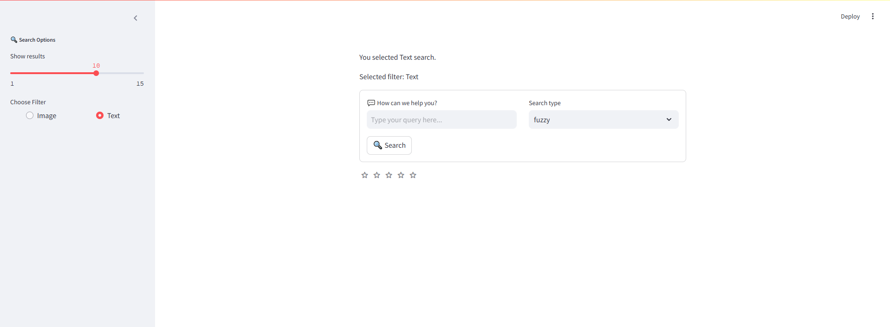
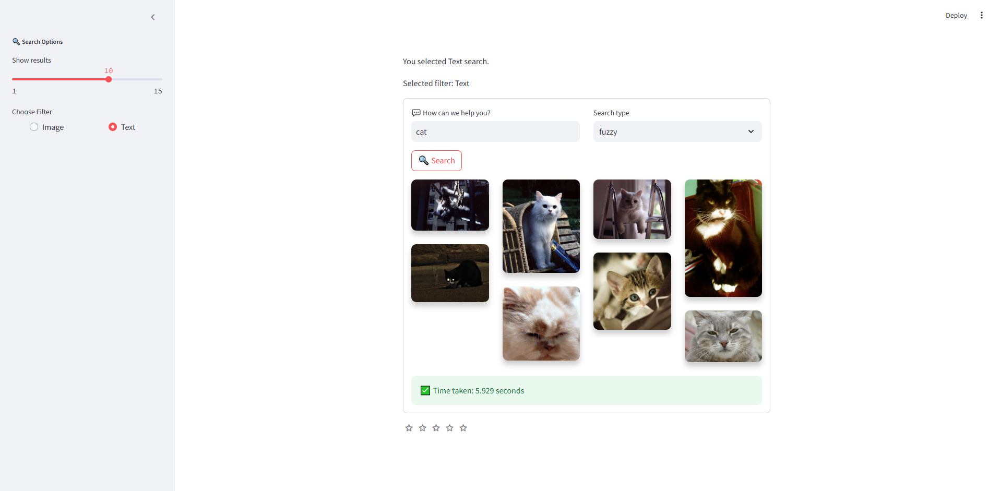

# 📦 Image and Text Search Engine with VGG16, Elasticsearch, FastAPI, Streamlit, and Logstash

This project is a high-performance **image and text search engine** leveraging **deep learning** and modern search technology. It uses the **VGG16** model for feature extraction from images and **Elasticsearch** for fast indexing and retrieval of data. A seamless backend API is provided with **FastAPI**, a user-friendly frontend interface with **Streamlit**, and **Logstash** is used for efficient data ingestion.

---

## 📂 **Project Architecture**


## 🚀 **How It Works**

### 1. **VGG16 Feature Extraction**  
- Uses the **VGG16 deep learning model** to extract high-level **feature vectors** from uploaded images.  
- These vectors represent images in a meaningful way, capturing important features like texture, color, and shape.

### 2. **Elasticsearch Integration**  
- Indexes both **image features and textual data** using **Elasticsearch**, ensuring **fast and accurate** search results with similarity matching. 

### 3. **FastAPI Backend**  
- Provides a **RESTful API** using **FastAPI** for handling search requests.  
- Users can query by **text** or **images** and receive relevant results from Elasticsearch.

### 4. **Streamlit Web Interface**  
- **Streamlit** provides an intuitive **web interface**, enabling users to upload images, enter search queries, and explore the results. 

### 5. **Logstash Data Ingestion**  
- **Logstash** automates the ingestion of **CSV files** and other structured data into Elasticsearch, streamlining the search process with up-to-date indexes.

---

## 📸 **Features**

- **Image Similarity Search**: Upload an image to find visually similar ones.
- **Text-based Search**: Perform searches with keywords or descriptions.
- **Deep Learning with VGG16**: Extract feature vectors for high-accuracy searches.
- **FastAPI Backend**: Offers fast and reliable API endpoints.
- **Interactive UI with Streamlit**: User-friendly frontend for easy interaction.
- **Automated Data Ingestion**: Logstash ensures up-to-date and organized data.

---

## 🛠️ **Technology Stack**

| Component         | Technology    |
|-------------------|---------------|
| **Feature Extraction** | VGG16 (Keras) |
| **Search Engine**     | Elasticsearch |
| **Backend API**       | FastAPI       |
| **Frontend Interface**| Streamlit     |
| **Data Ingestion**    | Logstash      |

---


## 🔧 **How to Run the Project**

### Prerequisites  
- Install Logstash and Elasticsearch
- Ensure all dependencies listed in the `requirements.txt` files are properly configured.

### 1. **Clone the Repository**

```bash
git clone <repository-url>
cd <repository-name>

```
### 4. **Manually Run the Frontend and Backend** 
#### 4.1 Run the Streamlit Frontend
```bash
cd Frontend
streamlit run app.py
```
Access the Streamlit web interface at http://localhost:8501.

#### 4.2 Run the FastAPI Backend
```bash
cd Backend
uvicorn route:app --reload
```

### 5. **Access the Web Interface and API**  
- **Frontend (Streamlit):** Open [http://localhost:8501](http://localhost:8501).  
- **Backend API (FastAPI):** Visit the Swagger docs at [http://localhost:8000/docs](http://localhost:8000/docs).

---

## 📂 **Folder Structure**

**Backend**

The Backend directory contains the core components of the backend service, responsible for data ingestion, feature extraction, and API routing.


```
├── backend.config.py        # Configuration settings for the backend service
├── ingest_data_elastic.py   # Script to ingest data into Elasticsearch
├── feature_extractor.py      # Module for extracting features from the ingested data
├── route.py                  # Defines the API routes and endpoints for the backend service
├── utils.py                  # Utility functions for processing data, including image and text searches in Elasticsearch               
```
**Frontend**

The Frontend directory includes the Streamlit application for user interaction.

```
├── app.py                    # Main entry point for the Streamlit frontend application
```
---

## 🛡️ **Environment Variables** 
To ensure the proper functioning of the search engine, set the following environment variables:

Elasticsearch Configuration:

```bash
elastic_url="http://localhost:9200"
elastic_usr="username"
elastic_pass="passwd"

Index Names:

index_name="images"
index_text="flickrphotos"

Paths for Data and Datasets:

csvPath="dataset/photo_metadata.csv"

Search Threshold:

threshold=0.7
```
---
## ⚙️ **How the Components Work Together**

- **VGG16 Feature Extraction:** Converts uploaded images into numerical vectors.  
- **Elasticsearch:** Stores these vectors and enables efficient similarity matching.  
- **FastAPI:** Handles API calls from the frontend and interacts with Elasticsearch.  
- **Streamlit:** Offers an interactive interface for users to upload images and view results.  
- **Logstash:** Automates the ingestion of structured data into Elasticsearch.

---
## 📊 Results
### Global Interface Description
The interface of the image search engine is designed to be user-friendly and intuitive. It features a clean layout where users can easily access both the text and image search functionalities. Users can quickly navigate through the results, making the search experience efficient and enjoyable. The interface also allows for easy uploads of images for content-based searches, enhancing the overall usability of the application.



### 🔍 Search Features

#### Search by Text
- Users can enter keywords or phrases to find relevant images.
- The search is performed against both indexed image metadata and textual descriptions.
- Results display relevant images alongside their corresponding metadata.


#### Search by Image
- Users can upload an image to perform a content-based search.
- The engine utilizes VGG16 to extract features from the uploaded image.
- Results display similar images based on visual content similarity.


